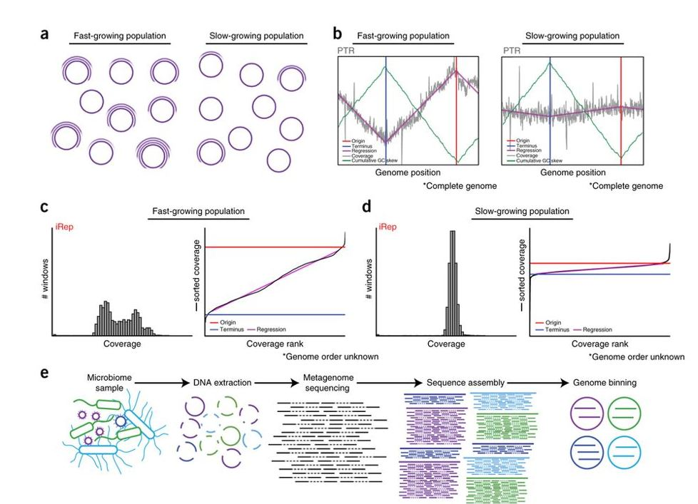
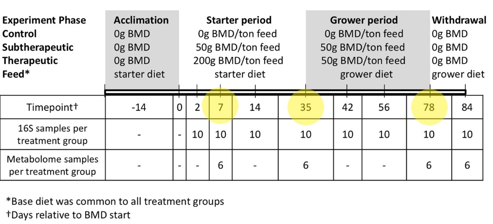

# Purpose  

The purpose of this analysis is to estimate the growth rates of bacterial species in the cecal microbiomes of turkey's fed various amounts of BMD (bacitracin methylene disalicylate)  

## How to estimate bacterial growth rate  

Taken from "Measurement of bacterial replication rates in microbial communities"  
Christopher T Brown, Matthew R Olm, Brian C Thomas & Jillian F Banfield  
Nature Biotechnology volume34, pages1256–1263 (2016)  

>Dividing cells in a natural population contain, on average, more than one copy of their genome. In an unsynchronized population of growing bacteria, cells contain genomes that are replicated to different extents, resulting in a gradual reduction in the average genome copy number from the origin to the terminus of replication. This decrease can be detected by measuring changes in DNA sequencing coverage across complete genomes. Bacterial genome replication proceeds bi-directionally from a single origin of replication, therefore the origin and terminus of replication can be deduced based on this coverage pattern. GC skew and genome coverage analyses of a wide variety of bacteria have shown that this replication mechanism is broadly applicable. Further, early studies of bacterial cultures revealed that cells can achieve faster division by simultaneously initiating multiple rounds of genome replication, which results in an average of more than two genome copies in rapidly growing cells.  
  
  
  


> *(a)* Populations of bacteria undergoing rapid cell division differ from slowly growing populations in that the individual cells of a growing population are more actively in the process of replicating their genomes (purple circles). *(b)* Differences in genome copy number across a population of replicating cells can be determined based on sequencing read coverage over complete genome sequences. The ratio between the coverage at the origin (“peak”) and terminus (“trough”) of replication (PTR) relates to the replication rate of the population. The origin and terminus can be determined based on cumulative GC skew. *(c,d)* If no complete genome sequence is available, it is possible to calculate the replication rate based on the distribution of coverage values across a draft-quality genome using the iRep method. Coverage is first calculated across overlapping segments of genome fragments. Growing populations will have a wider distribution of coverage values compared with stable populations (histograms). These values are ordered from lowest to highest, and linear regression is used to evaluate the coverage distribution across the genome in order to determine the coverage values associated with the origin and terminus of replication. iRep is calculated as the ratio of these values. *(e)* Genome-resolved metagenomics involves DNA extraction from a microbiome sample followed by DNA sequencing, assembly, and genome binning. Binning is the grouping together of assembled genome fragments that originated from the same genome. This can be done based on shared characteristics of each fragment, such as sequence composition, taxonomic affiliation, or abundance.  


# General workflow  

1. Assemble shotgun metagenome  
2. Bin metagenomic assembly into discrete genomes  
3. Calculate coverage patterns in these bins
4. Infer growth rate from coverage patterns  

## Experimental design


  
* Collected cecal contents at necropsy  
* 10 birds per treatment per timepoint = 90 samples total  
* No repeated measurements, (cecal contents are a terminal sample)  
* bulk DNA extraction  
  
  
## Data Description  

* HiSeq 2x150 PE reads  
    1 library per bird = 90 libraries  
    2,480,187,759 paired reads  
    avg insert = 280 bp  
  
* PacBio RSII reads  
    library preps from pooled samples  
    1 library prep per timepoint  
    equal pool of all treatments  
    3 PacBio RSII library preps  
    3 SMRT cells?  
    7,178,582 total reads
    Not as long as I was expecting

        
```{r, echo=FALSE, message=FALSE}

library(tidyverse)
hi <- read_tsv('ALL_pacbio_histogram.txt', skip = 9)


hi %>% 
  ggplot(aes(x=`#Length`, y=reads)) + geom_col() + theme_bw() + 
  ggtitle('histogram of pacbio read lengths')


hi %>% filter(`#Length` <5000) %>% 
  ggplot(aes(x=`#Length`, y=reads)) + geom_col() + theme_bw()+ 
  ggtitle('histogram of pacbio read lengths less than 5kb')

```


## Metagenomic Assembly  

* One large co-assembly with all data combined.  
* bbtools used to QC and normalize reads  
* Metaspades used for hybrid assembly  
    Standard short-read assembly, then long reads aligned to assembly graph  
    
### Read QC  


* The script ALL_QC.SLURM describes the pre-processing steps for the hiseq reads  
    1. remove optical duplicates  
    2. remove low quality regions on the flow cell  
    3. trim adapters  
    4. remove artifacts (phiX etc.)  
    5. remove turkey reads  
    6. error correct  
    7. normalize  
  
  
```{bash, eval=FALSE}
#!/bin/bash

#SBATCH --job-name="ALL_QC"                            # name of the job submitted
#SBATCH -p mem                                         # name of the queue you are submitting to
#SBATCH -n 40                                          # number of cores/tasks in this job, you get all 20 cores with 2 threads per core with hyperthreading
#SBATCH -N 1                                           # nodes
#SBATCH --mem=1000G                                    # memory allocation       
#SBATCH -t 72:00:00                                    # time allocated for this job hours:mins:seconds
#SBATCH --mail-user=julestrachsel@gmail.com            # will receive an email when job starts, ends or fails
#SBATCH --mail-type=BEGIN,END,FAIL                     # will receive an email when job starts, ends or fails
#SBATCH -o "stdout.%j.%N"                              # standard out %j adds job number to outputfile name and %N adds the node name
#SBATCH -e "stderr.%j.%N"                              # optional but it prints our standard error

# ENTER COMMANDS HERE:

module load java/1.8.0_121

set -e # I think this means if anything fails it immediately exits and doesnt keep plowing ahead.

#Written by Brian Bushnell
#Last updated March 4, 2019

#This script is designed to preprocess data for assembly of overlapping 2x150bp reads from Illumina HiSeq 2500.
#Some numbers and steps may need adjustment for different data types or file paths.
#For large genomes, tadpole and bbmerge (during the "Merge" phase) may need the flag "prefilter=2" to avoid running out of memory.
#"prefilter" makes these take twice as long though so don't use it if you have enough memory.
#The "rm ALL_temp.fq.gz; ln -s reads.fq.gz ALL_temp.fq.gz" is not necessary but added so that any pipeline stage can be easily disabled,
#without affecting the input file name of the next stage.

#interleave reads
#reformat.sh in=ALL_R#.fastq.gz out=ALL.fq.gz

# 92 fecal shotgun metagenomic libraries
# sequenced on HiSeq3000 2x150 PE
# I think avg insert sizes is ~280?

# this takes the R1 and R2 files and creates interleaved fastq.gz files for each
for x in *_R1.fastq.gz 
do
#echo "${x%_R1*}_R2.fastq.gz"
reformat.sh in1="$x" in2="${x%_R1*}_R2.fastq.gz" out="${x%_R1*}.fq.gz"
done

# combines all interleaved reads into one file
cat *.fq.gz > ALL.fq.gz

#Link the interleaved input file as "ALL_temp.fq.gz"
ln -s ALL.fq.gz ALL_temp.fq.gz

# --- Preprocessing ---

#Remove optical duplicates
clumpify.sh in=ALL_temp.fq.gz out=ALL.clumped.fq.gz dedupe optical
rm ALL_temp.fq.gz; ln -s ALL.clumped.fq.gz ALL_temp.fq.gz

#Remove low-quality regions
filterbytile.sh in=ALL_temp.fq.gz out=ALL.filtered_by_tile.fq.gz
rm ALL_temp.fq.gz; ln -s ALL.filtered_by_tile.fq.gz ALL_temp.fq.gz

#Trim adapters.  Optionally, reads with Ns can be discarded by adding "maxns=0" and reads with really low average quality can be discarded with "maq=8".
bbduk.sh in=ALL_temp.fq.gz out=ALL.trimmed.fq.gz ktrim=r k=23 mink=11 hdist=1 tbo tpe minlen=70 ref=adapters ftm=5 ordered
rm ALL_temp.fq.gz; ln -s ALL.trimmed.fq.gz ALL_temp.fq.gz

#Remove synthetic artifacts and spike-ins by kmer-matching.
bbduk.sh in=ALL_temp.fq.gz out=ALL.filtered.fq.gz k=31 ref=artifacts,phix ordered cardinality
rm ALL_temp.fq.gz; ln -s ALL.filtered.fq.gz ALL_temp.fq.gz

#Decontamination by mapping can be done here.
#JGI removes these in two phases:
#1) common microbial contaminants (E.coli, Pseudomonas, Delftia, others)
#2) common animal contaminants (Human, cat, dog, mouse)

bbsplit.sh in=SAMPLE_temp.fq.gz ref=turkey.fa basename=SAMPLE_out_%.fq.gz outu=SAMPLE_clean.fq.gz int=t
rm SAMPLE_temp.fq.gz; ln -s SAMPLE_clean.fq.gz SAMPLE_temp.fq.gz


#Error-correct phase 1
bbmerge.sh in=ALL_temp.fq.gz out=ALL.ecco.fq.gz ecco mix vstrict ordered ihist=ihist_merge1.txt
rm ALL_temp.fq.gz; ln -s ALL.ecco.fq.gz ALL_temp.fq.gz

#Error-correct phase 2
clumpify.sh in=ALL_temp.fq.gz out=ALL.eccc.fq.gz ecc passes=4 reorder
rm ALL_temp.fq.gz; ln -s ALL.eccc.fq.gz ALL_temp.fq.gz

#Error-correct phase 3
#Low-depth reads can be discarded here with the "tossjunk", "tossdepth", or "tossuncorrectable" flags.
#For very large datasets, "prefilter=1" or "prefilter=2" can be added to conserve memory.
#Alternatively, bbcms.sh can be used if Tadpole still runs out of memory.
tadpole.sh in=ALL_temp.fq.gz out=ALL.ecct.fq.gz ecc k=62 ordered tossjunk prefilter=1
rm ALL_temp.fq.gz; ln -s ALL.ecct.fq.gz ALL_temp.fq.gz

#Normalize
#This phase can be very beneficial for data with uneven coverage like metagenomes, MDA-amplified single cells, and RNA-seq, but is not usually recommended for isolate DNA.
#So normally, this stage should be commented out, as it is here.
bbnorm.sh in=ALL_temp.fq.gz out=normalized.fq.gz target=100 hist=khist.txt peaks=peaks.txt
rm ALL_temp.fq.gz; ln -s normalized.fq.gz ALL_temp.fq.gz
    
```

### Assembly with metaspades  
  
This ran for about 50 hours.  


```{bash, eval=FALSE}

#!/bin/bash

#SBATCH --job-name="metaspades"                         # name of the job submitted
#SBATCH -p mem                                          # name of the queue you are submitting to
#SBATCH -n 100                                          # number of cores/tasks in this job, you get all 20 cores with 2 threads per core with hyperthreading
#SBATCH -N 1                                            # number of nodes
#SBATCH --mem=1400G                                     # memory allocation
#SBATCH -t 167:00:00                                    # time allocated for this job hours:mins:seconds
#SBATCH --mail-user=YOUREMAILHERE@email.com             # will receive an email when job starts, ends or fails
#SBATCH --mail-type=BEGIN,END,FAIL                      # will receive an email when job starts, ends or fails
#SBATCH -o "stdout.%j.%N"                               # standard out %j adds job number to outputfile name and %N adds the node name
#SBATCH -e "stderr.%j.%N"                               # optional but it prints our standard error


module load java/1.8.0_121

# convert from interleaved to R1 R2 files
reformat.sh in=ALL_normalized.fq.gz out1=ALL_normalized_1.fq.gz out2=ALL_normalized_2.fq.gz

metaspades.py -o run1 -1 ALL_normalized_1.fq.gz -2 ALL_normalized_2.fq.gz --pacbio ALL_pacbio.fq.gz --only-assembler -m 1400 --tmp-dir "$TMPDIR" -t 100 -k 25,55,95,125

```

### Assembly statistics  

```{r setup, include=FALSE}
# knitr::opts_chunk$set(echo = FALSE)
# setwd('~/Torey/')
library(knitr)
library(kableExtra)
library(tidyverse)

megahit_maps <- read_tsv('./assembly_stats/megahit500__mapstats.tsv', col_names = c('sample', 'read1', 'read2')) %>% na.omit() %>% mutate(type='megahit')

metaspades_maps <- read_tsv('./assembly_stats/metaspades500_mapstats.tsv', col_names = c('sample', 'read1', 'read2')) %>% na.omit()%>% mutate(type='metaspades')


all_map <- rbind(megahit_maps, metaspades_maps)

all_map$day <- sub('(d[0-9]+)([a-z]+)([0-9]+)','\\1',all_map$sample)
all_map$treat <- sub('(d[0-9]+)([a-z]+)([0-9]+)','\\2',all_map$sample)
all_map$animal <- as.numeric(sub('(d[0-9]+)([a-z]+)([0-9]+)','\\3',all_map$sample))

all_map <- all_map %>% na.omit()

all_map_gather <- all_map %>% gather(-sample, -day, -treat, -animal, -type, key='read', value='percent_mapped')

test <- read_delim('./assembly_stats/test.txt', delim = '\t', col_types = 'ccccc')

detailed_stats <- read_delim('./assembly_stats/detailed_stats_comp.txt', delim = '\t')


```
***  


***  

* Comparison of full assemblies  
* contigs less than 500 bp removed  

```{r, echo=FALSE}
kable(detailed_stats, align = c('l','c','c')) %>% 
  row_spec(0, bold = T) %>% 
  kable_styling(bootstrap_options = c("striped")) 
```

* **Comparisons at different minimum contig length thresholds**  


```{r, echo=FALSE}
kable(test, align = c('lcccc'), col.names = c('min scaffold length', 'Megahit','Metaspades', 'Megahit','Metaspades')) %>% 
  row_spec(0, bold = T) %>%
  add_header_above(c(" ", "Number of Contigs" = 2, "Length of All Contigs" = 2)) %>% 
  kable_styling(full_width = F, bootstrap_options = c("striped")) %>% 
  column_spec(column = c(2,4), background = '#DEEBF7') %>% column_spec(column = c(3,5), background = "#E5F5E0")


```


* **What proportion of reads map to the assembly?**  


```{r echo=FALSE}


all_map %>% ggplot(aes(x=read1, y=read2, color=type)) + geom_smooth(method = 'lm', alpha=.3)+ geom_point() + ggtitle('No drastic differences in mapping between read 1 and read 2') + xlab('Percent read 1 mapping') + ylab('percent read 2 mapping')

# all_map_gather %>% ggplot(aes(x=read, y=percent_mapped)) + geom_boxplot() + geom_jitter() + ggtitle('percent reads mapped to megahit assembly by read')
# 
# all_map_gather %>% ggplot(aes(x=treat, y=percent_mapped)) + geom_boxplot() + geom_jitter()+ ggtitle('percent reads mapped to megahit assembly by treatment')
# 
# all_map_gather %>% ggplot(aes(x=day, y=percent_mapped)) + geom_boxplot() + geom_jitter() + ggtitle('percent reads mapped to megahit assembly by day')


all_map_gather %>% ggplot(aes(x=day, y=percent_mapped, fill=treat)) + geom_boxplot(outlier.colour = NA) + geom_jitter(alpha=.3) + ggtitle('percent reads mapped to megahit assembly by day') + facet_wrap(~type)

```

## Genome binning using Metabat2  

* Basic QC on reads  
* Map reads from each sample to Metaspades co-assembly  
* input indexed bam files to metabat2 for binning
  
  
### Read QC  
  
  
* This is a template I used to QC the reads prior to mapping:  
* script is named 'pre_mapping_QC.SLURM'

```{bash, eval=FALSE}
#!/bin/bash

#SBATCH --job-name="SAMPLE"                            # name of the job submitted
#SBATCH -p brief-low                                   # name of the queue you are submitting to
#SBATCH -n 30                                          # number of cores/tasks in this job, you get all 20 cores with 2 threads per core with hyperthreading
#SBATCH -N 1                                           # number of nodes
#SBATCH --mem=300G                                     # memory allocation 
#SBATCH -t 2:00:00                                     # time allocated for this job hours:mins:seconds
#SBATCH --mail-user=YOUREMAILHERE@email.com            # will receive an email when job starts, ends or fails
#SBATCH --mail-type=BEGIN,END,FAIL                     # will receive an email when job starts, ends or fails
#SBATCH -o "stdout.%j.%N"                              # standard out %j adds job number to outputfile name and %N adds the node name
#SBATCH -e "stderr.%j.%N"                              # optional but it prints our standard error

# ENTER COMMANDS HERE:

module load java/1.8.0_121

set -e # I think this means if anything fails it immediately exits and doesnt keep plowing ahead.

#Written by Brian Bushnell
#Last updated March 4, 2019

#This script is designed to preprocess data for assembly of overlapping 2x150bp reads from Illumina HiSeq 2500.
#Some numbers and steps may need adjustment for different data types or file paths.
#For large genomes, tadpole and bbmerge (during the "Merge" phase) may need the flag "prefilter=2" to avoid running out of memory.
#"prefilter" makes these take twice as long though so don't use it if you have enough memory.
#The "rm SAMPLE_temp.fq.gz; ln -s reads.fq.gz SAMPLE_temp.fq.gz" is not necessary but added so that any pipeline stage can be easily disabled,
#without affecting the input file name of the next stage.

#interleave reads
reformat.sh in=SAMPLE_R#.fastq.gz out=SAMPLE.fq.gz

#Link the interleaved input file as "SAMPLE_temp.fq.gz"
ln -s SAMPLE.fq.gz SAMPLE_temp.fq.gz

# --- Preprocessing ---

#Remove optical duplicates
clumpify.sh in=SAMPLE_temp.fq.gz out=SAMPLE.clumped.fq.gz dedupe optical
rm SAMPLE_temp.fq.gz; ln -s SAMPLE.clumped.fq.gz SAMPLE_temp.fq.gz

#Remove low-quality regions
filterbytile.sh in=SAMPLE_temp.fq.gz out=SAMPLE.filtered_by_tile.fq.gz
rm SAMPLE_temp.fq.gz; ln -s SAMPLE.filtered_by_tile.fq.gz SAMPLE_temp.fq.gz

#Trim adapters.  Optionally, reads with Ns can be discarded by adding "maxns=0" and reads with really low average quality can be discarded with "maq=8".
bbduk.sh in=SAMPLE_temp.fq.gz out=SAMPLE.trimmed.fq.gz ktrim=r k=23 mink=11 hdist=1 tbo tpe minlen=70 ref=adapters ftm=5 ordered
rm SAMPLE_temp.fq.gz; ln -s SAMPLE.trimmed.fq.gz SAMPLE_temp.fq.gz

#Remove synthetic artifacts and spike-ins by kmer-matching.
bbduk.sh in=SAMPLE_temp.fq.gz out=SAMPLE.filtered.fq.gz k=31 ref=artifacts,phix ordered cardinality
rm SAMPLE_temp.fq.gz; ln -s SAMPLE.filtered.fq.gz SAMPLE_temp.fq.gz


```

  
  
* This script is just a template, I used it to create a SLURM script for each sample using a loop like this:  


```{bash, eval=FALSE}

# create a list of all samples:
for x in *R1*gz;
do
echo "${x%_S*}" >> samples.txt
done


# generate a SLURM script for each sample
while read line
do
cat pre_mapping_QC.SLURM | sed "s/SAMPLE/$line/g" > "$line"_tmp.SLURM
done < samples.txt

# After you confirm they look good, submit with:
for x in *_tmp.SLURM
do
sbatch $x
done 


```


### Map reads to Assembly  

* this script is called metagenome_map4bin.SLURM

```{bash, eval=FALSE}
#!/bin/bash

#SBATCH --job-name="SAMPLE"                            # name of the job submitted
#SBATCH -p mem-low                                     # name of the queue you are submitting to
#SBATCH -n 40                                          # number of cores/tasks in this job, you get all 20 cores with 2 threads per core with hyperthreading
#SBATCH -N 1                                           # number of nodes
#SBATCH --mem=200G                                     # memory allocation
#SBATCH -t 2:00:00                                     # time allocated for this job hours:mins:seconds
#SBATCH --mail-user=julestrachsel@gmail.com            # will receive an email when job starts, ends or fails
#SBATCH --mail-type=BEGIN,END,FAIL                     # will receive an email when job starts, ends or fails
#SBATCH -o "stdout.%j.%N"                              # standard out %j adds job number to outputfile name and %N adds the node name
#SBATCH -e "stderr.%j.%N"                              # optional but it prints our standard error

# ENTER COMMANDS HERE:

module load java/1.8.0_121
module load samtools
module load pigz

set -e # I think this means if anything fails it immediately exits and doesnt keep plowing ahead.


# FIRST GENERATING AN INDEXED REFERENCE WITH 
# bbmap.sh ref=metaspades_500_scaff.fa

# then all jobs will just use this pre-indexed reference. I am doing this with an interactive shell prior to submitting the SLURMS

# not specifying reference because of preindexing listed above.


bbmap.sh in=../hiseq/SAMPLE.filtered.fq.gz outm=SAMPLE_mapped.sam.gz bs=SAMPLE.bamscript qtrim=10 untrim ambig=all pigz unpigz

# this bamscript will generate sorted & indexed bam files
chmod u+x SAMPLE.bamscript
./SAMPLE.bamscript

```


* Again, this script is just a template, I used it to create a SLURM script for each sample using a loop like the one previously mentioned.  

* This script will output sams as well as indexed bams for each sample mapping to the co-assembly.  

### Run metabat  

* This script is called metabat.SLURM and is available in the SLURM directory  


```{bash, eval=FALSE}
#!/bin/bash

#SBATCH --job-name="metabat"                            # name of the job submitted
#SBATCH -p mem                                          # name of the queue you are submitting to
#SBATCH -n 40                                           # number of cores/tasks in this job, you get all 20 cores with 2 threads per core with hyperthreading
#SBATCH -N 1                                            # number of nodes
#SBATCH --mem=125G                                      # memory allocation
#SBATCH -t 47:00:00                                     # time allocated for this job hours:mins:seconds
#SBATCH --mail-user=YOUREMAIL@email.com                 # will receive an email when job starts, ends or fails
#SBATCH --mail-type=BEGIN,END,FAIL                      # will receive an email when job starts, ends or fails
#SBATCH -o "stdout.%j.%N"                               # standard out %j adds job number to outputfile name and %N adds the node name
#SBATCH -e "stderr.%j.%N"                               # optional but it prints our standard error

# ENTER COMMANDS HERE:

module load metabat
module load checkm/v1.0.11

jgi_summarize_bam_contig_depths --outputDepth depth.txt --pairedContigs paired.txt --minContigLength 1000 --minContigDepth 2 *.bam

metabat -i metaspades_500_scaff.fa -a depth.txt -o run1/bin -v --saveTNF saved.tnf --saveDistance saved.dist
checkm lineage_wf -f run1/CheckM.txt -t 32 -x fa run1/ run1/SCG

```

* Metabat identified 1067 bins in our data, not all meet the requirements of iRep  
* iRep requirements:  
    1. Only considers contigs longer than 5kb  
    2. more than 75% complete  
    3. less than 2.5% contamination  
    4. not more than 200 contigs
  
### Filter bins  

* **remove contigs shorter than 5kb**  

* This is the python code I used to remove contigs shorter than 5kb from each bin as well as remove the bins with more than 200 contigs.  
  
  
  
```{python, eval=FALSE, python.reticulate=FALSE}

from Bio import SeqIO
import os

files = os.listdir()

for fasta in files:
        new_genome = []
        genome = SeqIO.parse(fasta, 'fasta')
        for seq in genome:
                if len(seq.seq) > 4999:
                        new_genome.append(seq)
        if 0 < len(new_genome) < 200:
                new_genome_handle = fasta.strip('.fa') + '_new.fasta'
                SeqIO.write(new_genome, new_genome_handle, 'fasta')
        else:
                pass


```


### recalculate checkM completeness metrics  

* This script runs checkM on the length filtered bins  
* should be run from a directory containing the length filtered bin fastas  
* Named 'checkm.SLURM' and is available in the SLURM directory  


```{bash, eval=FALSE}
#!/bin/bash

#SBATCH --job-name="checkm"                            # name of the job submitted
#SBATCH -p short                                       # name of the queue you are submitting to
#SBATCH -n 16
#SBATCH -N 1
#SBATCH --mem=48G                                      # number of cores/tasks in this job, you get all 20 cores with 2 threads per core with hyperthreading
#SBATCH -t 47:00:00                                    # time allocated for this job hours:mins:seconds
#SBATCH --mail-user=julestrachsel@gmail.com             # will receive an email when job starts, ends or fails
#SBATCH --mail-type=BEGIN,END,FAIL                      # will receive an email when job starts, ends or fails
#SBATCH -o "stdout.%j.%N"                               # standard out %j adds job number to outputfile name and %N adds the node name
#SBATCH -e "stderr.%j.%N"                               # optional but it prints our standard error

# ENTER COMMANDS HERE:

module load checkm

checkm lineage_wf -f out/CheckM.txt -t 16 -x fasta ./ ./out


```

* Now that the completness metrics are re-calculated, we need to pull out the bins that meet the requirements of iRep.  
* This chunk identifies genomes that are more than 75% complete and have less than 2.5% contamination (column 13 and 14 in the checkm output).  
* genomes meeting these requirements are then moved to their own 'good_bins' directory.  

```{bash, eval=FALSE}
awk '(NR>3) && ($13 > 75) && ($14 <2.5)' CheckM.txt > GOOD_BINS.txt

for bin in $(awk '{print $1}' GOOD_BINS.txt) ; do cp "$bin".fa ./good_bins/; done

```


## Calculate growth rate for good bins  
  
* iRep is not installed system wide on CERES, but it can be easily installed using conda.  
* Most of the work is done, we can actually use the sam files generated prior to metabat to calculate the coverage patterns of the good bins.  
* The following script is a template for running iRep. It is named iREP7_template.SLURM and is available in the SLURM directory.  
* You can generate SLURM scripts for each sample using the same kind of loop that was discussed earlier.  


```{bash, eval=FALSE}
#!/bin/bash

#SBATCH --job-name="SAMPLE"                             # name of the job submitted
#SBATCH -p short                                        # name of the queue you are submitting to
#SBATCH -n 8                                            # number of cores/tasks 
#SBATCH -N 1
#SBATCH --mem=100G                                      # memory allocation
#SBATCH -t 47:00:00                                     # time allocated for this job hours:mins:seconds
#SBATCH --mail-user=YOUREMAIL@email.com                 # will receive an email when job fails
#SBATCH --mail-type=FAIL                                # will receive an email when job fails
#SBATCH -o "stdout.%j.%N"                               # standard out %j adds job number to outputfile name and %N adds the node name
#SBATCH -e "stderr.%j.%N"                               # optional but it prints our standard error

# ENTER COMMANDS HERE:

# activate the conda environment
source ~/iREP/bin/activate

gunzip SAMPLE_mapped.sam.gz

# allows iRep to tolerate 7 mismatches, over ~150bp reads this is about 95%
iRep -f *.fa -s SAMPLE_mapped.sam -o SAMPLE.out -mm 7 -t 8 --no-plot --sort


```


* Once all these jobs complete we will compile all the results into one file.  

```{bash, eval=FALSE}
#!/bin/bash

#SBATCH --job-name="7_compile"                          # name of the job submitted
#SBATCH -p short                                        # name of the queue you are submitting to
#SBATCH -n 8                                            # number of cores/tasks in this job, you get all 20 cores with 2 threads per core with hyperthreading
#SBATCH -N 1                                            # nodes
#SBATCH --mem=32G                                       # memory allocation
#SBATCH -t 47:00:00                                     # time allocated for this job hours:mins:seconds
#SBATCH --mail-user=julestrachsel@gmail.com             # will receive an email when job fails
#SBATCH --mail-type=FAIL                                # will receive an email when job fails
#SBATCH -o "stdout.%j.%N"                               # standard out %j adds job number to outputfile name and %N adds the node name
#SBATCH -e "stderr.%j.%N"                               # optional but it prints our standard error

# ENTER COMMANDS HERE:

source ~/iREP/bin/activate

iRep_filter.py -c 3 -w 93 -t *tsv --long > ALL_RESULTS_long


```

* Once this job finishes we are ready to move on to the real action.  

# Data analysis  

## First look  
* How much data do we have?  
* Are there issues with it?  
* Anything suspicious?  

```{r, message=FALSE}
library(tidyverse)
library(broom)
library(lme4)
library(lmerTest)

#  CheckM bin info  #
colnams <- c('bin', 'marker_lineage', 'num_genomes', 'num_markers', 'num_marker_sets', 'x0', 'x1', 'x2', 'x3','x4','x5+', 'Completeness', 'Contamination', 'Strain_heterogeneity')

checkm <- read_delim('CheckM_clean3.txt', delim = '\t', trim_ws = TRUE, skip = 2, col_names = colnams) %>%
  mutate(bin=sub('_new', '', bin)) 


# read in the data and extract some metadata from sample names
dat <- read_tsv('ALL_RESULTS_BULK_MAP.txt', skip = 1, col_types = c('iccnnnnnnninn'))%>%
  mutate(sample = sub('_mapped.sam','',sample),
         genome = sub('.fa','',genome),
         day = sub('d([0-9][0-9])([a-z]+)([0-9][0-9][0-9])','\\1',sample), 
         treatment = sub('d([0-9][0-9])([a-z]+)([0-9][0-9][0-9])','\\2',sample), 
         bird = sub('d([0-9][0-9])([a-z]+)([0-9][0-9][0-9])','\\3',sample), 
         day_num = as.numeric(day))  %>% 
  filter(!(is.na(iRep))) %>%
  filter(!grepl('ex', sample)) %>% 
  select(-X1, -`fragments/Mbp`)


dat <- dat %>% filter(coverage > 5)  # only keep estimates from samples where bins had > 5x coverage (as reccommended)

# Histogram of all iRep estimates
dat %>% ggplot(aes(x=iRep)) +
  geom_histogram(bins = 50) +
  theme_bw() + ggtitle('Histogram of all valid iRep estimates')


# some bins have extremely high coverage / relative abundance
dat %>% ggplot(aes(x=(coverage))) + geom_histogram(bins = 100) + 
  ggtitle('Histogram of bin coverages') +
  theme_bw()

dat %>%
  ggplot(aes(x=log2(coverage))) +
  geom_histogram(bins = 100) +
  ggtitle('Histogram of log(coverage)') + 
  theme_bw()


dat %>%
  ggplot(aes(x=`relative abundance`)) +
  geom_histogram(bins = 100) +
  ggtitle('Histogram of relative_abundance') + 
  theme_bw()


dat %>%
  ggplot(aes(x=(log2(`relative abundance`)))) +
  geom_histogram(bins = 100) +
  ggtitle('Histogram of log(relative_abundance)') + 
  theme_bw()

#### iRep is significantly negatively correlated with both coverage and relative abundance

cor.test(x = dat$iRep, log(dat$`relative abundance`))
dat %>% ggplot(aes(x=log(`relative abundance`), y=iRep)) +
  geom_point() +
  geom_smooth(method = 'lm') +
  theme_bw()

# what about testing this within each bin?


valid_irep_totbin <- dat %>% 
  group_by(genome) %>%
  tally() %>%
  arrange(desc(n))

valid_irep_totbin %>%
  ggplot(aes(x=n)) +
  geom_histogram(bins = 50) +
  xlab('number of valid iRep estimates')+
  ggtitle('number of valid iRep estimates per bin') + 
  theme_bw()


dat %>% nrow()
# 2278 valid iRep estimates

dat %>% select(genome) %>% unlist() %>% unique() %>% length()
# from 244 genomes


# How do these estimates look by treatment? by day?
# boxplots
dat %>% 
  ggplot(aes(x=treatment, y=iRep)) + geom_boxplot() + facet_wrap(~day) + 
  theme_bw()

dat %>% 
  ggplot(aes(x=day, y=iRep)) + geom_boxplot() + facet_wrap(~treatment)+ 
  theme_bw()

### neat, maybe a treatment effect? 
### maybe a time effect? 

### But, we dont know if we are measuring the same genomes growth rates in each of these categories...

#####  main point here is that the data are sparse #######

# calculating which bins have enough datapoints available for meaningful stats

number_of_obs <- dat %>% 
  group_by(day, treatment, genome) %>% 
  tally() %>% spread(key = treatment, value=n) %>%
  ungroup() %>% group_by(day, genome) %>% 
  mutate(num_NA = sum(is.na(c(ctrl, sub, ther))), 
         num_w_4p = sum(c(ctrl, sub, ther) >3, na.rm = TRUE)) %>% 
  ungroup() %>% 
  unite(col = 'bin_day', genome, day, remove = FALSE)
  
number_of_obs


# data grouped by bin and day to tally numobs per group


# These have at least 1 treatment group with 4+ observations at the given timepoint

one_group <- number_of_obs %>%  filter(num_w_4p >= 1)
one_group


#### These have at least 2 groups with 4+ observations
two_groups <- number_of_obs %>%  filter(num_w_4p > 1)  
two_groups

# these have all 3 groups represented by at least 4 data points each
all_groups <- number_of_obs %>% filter(num_w_4p == 3)
all_groups

# no bin has 4 or more observations in every group at every timepoint
number_of_obs %>% select(genome, day, num_w_4p) %>%
  spread(key = day, value = num_w_4p) %>% 
  mutate(all_times = `07`+ `35`+ `78`) %>% arrange(desc(all_times)) %>% 
  mutate(d7g = ifelse(`07` == 3, TRUE, FALSE), 
         d35g = ifelse(`35` == 3, TRUE, FALSE),
         d78g = ifelse(`78` == 3, TRUE, FALSE))


# kindof makes sense, both ABX treatment and time affected the community composition
#
# Will probably have to stick to comparing iRep estimates in two main ways:
#  1) Within timepoint between treatments
#  2) within a treatment between timepoints


## one timepoint ##

# 8 bins have all treatment groups represented with 4+ observations at D7
D7 <- all_groups %>%
  select(genome, day, num_w_4p) %>% 
  spread(key=day, value = num_w_4p) %>% 
  filter(!is.na(`07`))
D7

# 11 bins have all treatment groups represented with 4+ observations at D35
D35 <- all_groups %>%
  select(genome, day, num_w_4p) %>% 
  spread(key=day, value = num_w_4p) %>% 
  filter(!is.na(`35`))
D35

# 8 bins have all treatment groups represented with 4+ observations at D78
D78 <- all_groups %>%
  select(genome, day, num_w_4p) %>% 
  spread(key=day, value = num_w_4p) %>% 
  filter(!is.na(`78`))
D78

### 2 timepoints ###

# 4 bins have all 3 groups with 4+ observations at both d7 and d35
all_groups %>%
  select(genome, day, num_w_4p) %>% 
  spread(key=day, value = num_w_4p) %>% 
  mutate(d7vd35 = `07` + `35`) %>% 
  filter(!is.na(d7vd35))

# 1 bin has all 3 groups with 4+ observations at both d35 and d78
all_groups %>%
  select(genome, day, num_w_4p) %>% 
  spread(key=day, value = num_w_4p) %>% 
  mutate(d35vd78 = `35` + `78`) %>% 
  filter(!is.na(d35vd78))

# no bin has all 3 groups with 4+ observations at d7 and d78
all_groups %>%
  select(genome, day, num_w_4p) %>% 
  spread(key=day, value = num_w_4p) %>% 
  mutate(d07vd78 = `07` + `78`) %>% 
  filter(!is.na(d07vd78))


##### These sets of bins can be used to investigate time effect #####
##### within each treatment #####

# these ones can compare d7 vs d35 in ctrl

# 15 bins
ctrl735 <- number_of_obs %>% 
#  filter(num_w_4p >1) %>%
#  filter(ctrl >3) %>%
  select(-bin_day, -num_NA, -num_w_4p) %>% 
  gather(key = 'treat', value = 'count', -day, -genome) %>%
  unite(col='treat_day', treat, day) %>% spread(key=treat_day, value=count) %>% 
  select(genome, starts_with('ctrl')) %>% 
  filter(ctrl_07 > 3 & ctrl_35 > 3)
ctrl735

# 8 bins
sub735 <- number_of_obs %>% 
  #  filter(num_w_4p >1) %>%
  #  filter(ctrl >3) %>%
  select(-bin_day, -num_NA, -num_w_4p) %>% 
  gather(key = 'treat', value = 'count', -day, -genome) %>%
  unite(col='treat_day', treat, day) %>% spread(key=treat_day, value=count) %>% 
  select(genome, starts_with('sub')) %>% 
  filter(sub_07 > 3 & sub_35 > 3)
sub735

# 11 bins
ther735 <- number_of_obs %>% 
  #  filter(num_w_4p >1) %>%
  #  filter(ctrl >3) %>%
  select(-bin_day, -num_NA, -num_w_4p) %>% 
  gather(key = 'treat', value = 'count', -day, -genome) %>%
  unite(col='treat_day', treat, day) %>% spread(key=treat_day, value=count) %>% 
  select(genome, starts_with('ther')) %>% 
  filter(ther_07 > 3 & ther_35 > 3)
ther735


# start to pair down the data to only include genomes that have enough data for comparisons?

##### only includes estimates from bins that have at least 1 treatment with 4+ observations in any one timepoint  ##


dat %>% unite(col = 'bin_day', genome, day, remove = FALSE) %>% 
  filter(bin_day %in% one_group$bin_day) %>% nrow()
# 1572 observations

dat %>% unite(col = 'bin_day', genome, day, remove = FALSE) %>% 
  filter(bin_day %in% one_group$bin_day) %>%
  select(genome) %>% unlist() %>% unique() %>% length()
#102 genomes


# histogram
dat %>% unite(col = 'bin_day', genome, day, remove = FALSE) %>% 
  filter(bin_day %in% one_group$bin_day) %>% 
  ggplot(aes(x=iRep)) + 
  geom_histogram(bins=50)+
  theme_bw() + 
  ggtitle('Histogram of iRep estimates',
          'considering only those genomes that have \nat least 1 treatment with 4+ observations at any time')

dat %>% unite(col = 'bin_day', genome, day, remove = FALSE) %>% 
  filter(bin_day %in% one_group$bin_day) %>%
  group_by(genome) %>%
  tally() %>% 
  ggplot(aes(x=n))+geom_histogram(bins=30) + 
  ggtitle('Valid iRep estimates per genome', 
          'considering only those genomes that have \nat least 1 treatment with 4+ observations at any time')


# boxplots
dat %>% unite(col = 'bin_day', genome, day, remove = FALSE) %>% 
  filter(bin_day %in% one_group$bin_day) %>% 
  ggplot(aes(x=treatment, y=iRep)) + geom_boxplot() + facet_wrap(~day) + 
  ggtitle('iRep estimates by treatment',
          'considering only those genomes that have \nat least 1 treatment with 4+ observations at any time')

dat %>% unite(col = 'bin_day', genome, day, remove = FALSE) %>% 
  filter(bin_day %in% one_group$bin_day) %>% 
  ggplot(aes(x=day, y=iRep)) + geom_boxplot() + facet_wrap(~treatment) +
  ggtitle('iRep estimates by time', 
          'considering only those genomes that have \nat least 1 treatment with 4+ observations at any time')


### 2 with 4 plus ###
# only includes bins that have at least 2 treatments with 4+ observations

dat %>% unite(col = 'bin_day', genome, day, remove = FALSE) %>% 
  filter(bin_day %in% two_groups$bin_day) %>% nrow()
# 1062 observations

dat %>% unite(col = 'bin_day', genome, day, remove = FALSE) %>% 
  filter(bin_day %in% two_groups$bin_day) %>%
  select(genome) %>% unlist() %>% unique() %>% length()
#56 genomes


# histogram
dat %>% unite(col = 'bin_day', genome, day, remove = FALSE) %>% 
  filter(bin_day %in% two_groups$bin_day) %>% 
  ggplot(aes(x=iRep)) + 
  geom_histogram(bins=50)+
  theme_bw() + 
  ggtitle('Histogram of iRep estimates',
          'considering only those genomes that have \nat least 2 treatments with 4+ observations at any time')

dat %>% unite(col = 'bin_day', genome, day, remove = FALSE) %>% 
  filter(bin_day %in% two_groups$bin_day) %>%
  group_by(genome) %>%
  tally() %>% 
  ggplot(aes(x=n))+geom_histogram(bins=30) + 
  ggtitle('Valid iRep estimates per genome', 
          'considering only those genomes that have \nat least 2 treatments with 4+ observations at any time')


# boxplots
dat %>% unite(col = 'bin_day', genome, day, remove = FALSE) %>% 
  filter(bin_day %in% two_groups$bin_day) %>% 
  ggplot(aes(x=treatment, y=iRep)) + geom_boxplot() + facet_wrap(~day) + 
  ggtitle('iRep estimates by treatment',
          'considering only those genomes that have \nat least 2 treatments with 4+ observations at any time')

dat %>% unite(col = 'bin_day', genome, day, remove = FALSE) %>% 
  filter(bin_day %in% two_groups$bin_day) %>% 
  ggplot(aes(x=day, y=iRep)) + geom_boxplot() + facet_wrap(~treatment) +
  ggtitle('iRep estimates by time', 
          'considering only those genomes that have \nat least 2 treatments with 4+ observations at any time')


### 3 with 4 plus ###
# only includes bins with 4+ observations in all 3 treatments at any one timepoint

dat %>% unite(col = 'bin_day', genome, day, remove = FALSE) %>% 
  filter(bin_day %in% all_groups$bin_day) %>% nrow()
# 507 observations

dat %>% unite(col = 'bin_day', genome, day, remove = FALSE) %>% 
  filter(bin_day %in% all_groups$bin_day) %>%
  select(genome) %>% unlist() %>% unique() %>% length()
#22 genomes


# histogram
dat %>% unite(col = 'bin_day', genome, day, remove = FALSE) %>% 
  filter(bin_day %in% all_groups$bin_day) %>% 
  ggplot(aes(x=iRep)) + 
  geom_histogram(bins=50)+
  theme_bw() + 
  ggtitle('Histogram of iRep estimates',
          'considering only those genomes that have \nat least 3 treatments with 4+ observations at any time')

dat %>% unite(col = 'bin_day', genome, day, remove = FALSE) %>% 
  filter(bin_day %in% all_groups$bin_day) %>%
  group_by(genome) %>%
  tally() %>% 
  ggplot(aes(x=n))+geom_histogram(bins=30) + 
  ggtitle('Valid iRep estimates per genome', 
          'considering only those genomes that have \nat least 3 treatments with 4+ observations at any time')


# boxplots
dat %>% unite(col = 'bin_day', genome, day, remove = FALSE) %>% 
  filter(bin_day %in% all_groups$bin_day) %>% 
  ggplot(aes(x=treatment, y=iRep)) + geom_boxplot() + facet_wrap(~day) + 
  ggtitle('iRep estimates by treatment',
          'considering only those genomes that have \nat least 3 treatments with 4+ observations at any time')

dat %>% unite(col = 'bin_day', genome, day, remove = FALSE) %>% 
  filter(bin_day %in% all_groups$bin_day) %>% 
  ggplot(aes(x=day, y=iRep)) + geom_boxplot() + facet_wrap(~treatment) +
  ggtitle('iRep estimates by time', 
          'considering only those genomes that have \nat least 3 treatments with 4+ observations at any time')
```


***  
***  

* Well, the data aren't idea, but we'll try to get something meaningful out of it.  

* Specifically I am interested if there is statistical evidence for these two hypothesis:  
    1) growth rates are supressed in the abx treatments relative to the controls  
    2) growth rates are lower in the d35 communities relative to the D7 communities  


## Treatment Effects  

* Only trying to asses treatment effect within each day.  

 
 
```{r}
############ DAY 7 DIFFS BTWEEN GRUOPS ##########
# only includes genomes with 4+ observations in all 3 treatment groups at D7
# 8 genomes, 149 observations

dat %>% filter(genome %in% D7$genome & day %in% c('07'))%>% 
  ggplot(aes(x=treatment, y=iRep, fill=treatment)) + geom_violin() + geom_jitter(shape=21, width = .2)+
  ggtitle('iRep growth rate estimates at D7', '') + theme_bw() +
  stat_summary(fun.y = "mean", colour = "black", size = 2, geom = "point")

dat %>% filter(genome %in% D7$genome & day %in% c('07'))%>% 
  ggplot(aes(x=genome, y=iRep, fill=treatment)) +
  geom_boxplot() +
  geom_jitter(shape=21, position=position_dodge2(width = .75)) + 
  ggtitle('iRep growth rate estimates at D7') + theme_bw()


D7_treat_comp <- dat %>% filter(genome %in% D7$genome & day %in% c('07'))


D7_tukeys <- D7_treat_comp %>% group_by(genome) %>% nest() %>% 
  mutate(ANOVA=map(data, ~ aov(data=., iRep ~ treatment)), 
         tuk = map(ANOVA, TukeyHSD), 
         tid_tuk = map(tuk, tidy)) %>% 
  select(genome, tid_tuk) %>% 
  unnest(cols = tid_tuk) %>%
  mutate(tuk_pval = adj.p.value, 
         fdr.pval = p.adjust(tuk_pval, method = 'fdr'))

sigs <- D7_tukeys %>%
  select(-adj.p.value) %>% filter(tuk_pval < 0.05)

sigs
sigs_fdr <- sigs %>% filter(fdr.pval < 0.1)


# only those bins with a sig difference detected in tukey's test
dat %>% filter(genome %in% D7$genome & day %in% c('07'))%>% 
  filter(genome %in% sigs$genome) %>% 
  ggplot(aes(x=genome, y=iRep, fill=treatment)) +
  geom_boxplot() +
  geom_jitter(shape=21, position=position_dodge2(width = .75)) + 
  ggtitle('iRep growth rate estimates at D7', 'tukey pval < 0.05 -- not adjusted for multiple tukeys') + theme_bw()


dat %>% filter(genome %in% D7$genome & day %in% c('07'))%>% 
  filter(genome %in% sigs_fdr$genome) %>% 
  ggplot(aes(x=genome, y=iRep, fill=treatment)) +
  geom_boxplot() +
  geom_jitter(shape=21, position=position_dodge2(width = .75)) + 
  ggtitle('iRep growth rate estimates at D7', 'fdr pval < 0.10') + theme_bw()


D7_tukeys %>% #filter(comparison != 'ther-sub') %>% 
  ggplot(aes(x=genome, y=estimate)) +
  geom_point() +
  geom_errorbar(aes(ymin=conf.low, ymax=conf.high), width=.2) + 
  coord_flip() + geom_hline(yintercept = 0, color='red') + 
  ggtitle('95% confidence intervals for the difference in growth rate between treatments',
          'negative estimates indicate higher growth rate in ctrl, D7 only')+ facet_wrap(~comparison)

# mixed model? not super confident about this.
summary(lmer(data = D7_treat_comp, formula = iRep ~ treatment + (1|genome)))
checkm %>% filter(bin %in% sigs$genome) %>% select(bin, marker_lineage, Completeness, Contamination)


###### DAY 35 DIFF BTWEEN GROUPS #######
# only includes genomes with 4+ observations in all 3 treatment groups at D35
# 11 genomes, 211 observations


D35_treat_comp <- dat %>% filter(genome %in% D35$genome & day %in% c('35'))


D35_treat_comp %>% ggplot(aes(x=treatment, y=iRep, fill=treatment)) +
  geom_violin() + geom_jitter(shape=21, width = .2) + 
  ggtitle('iRep growth rate estimates at D35') + theme_bw()


dat %>% filter(genome %in% D35$genome & day %in% c('35'))%>% 
  ggplot(aes(x=genome, y=iRep, fill=treatment)) + geom_boxplot() +
  geom_jitter(shape=21, position=position_dodge2(width = .75)) +
  ggtitle('iRep growth rate estimates at D35, by genome') + theme_bw()


D35_tukeys <- D35_treat_comp %>% group_by(genome) %>% nest() %>% 
  mutate(ANOVA=map(data, ~ aov(data=., iRep ~ treatment)), 
         tuk = map(ANOVA, TukeyHSD), 
         tid_tuk = map(tuk, tidy)) %>% 
  select(genome, tid_tuk) %>% 
  unnest(cols = tid_tuk) %>%
  mutate(tuk_pval = adj.p.value, 
         fdr.pval = p.adjust(tuk_pval, method = 'fdr')) 

sigs <- D35_tukeys %>% 
  select(-adj.p.value) %>% filter(tuk_pval < 0.05)

# no sigs by anova/tukey


D35_tukeys %>% #filter(comparison != 'ther-sub') %>% 
  ggplot(aes(x=genome, y=estimate)) +
  geom_point() +
  geom_errorbar(aes(ymin=conf.low, ymax=conf.high), width=.2) + 
  coord_flip() + geom_hline(yintercept = 0, color='red') + 
  ggtitle('95% confidence intervals for the difference in growth rate between treatments',
          'negative estimates indicate higher growth rate in ctrl, D35 only')+ facet_wrap(~comparison)

# mixed model? not super confident about this.
summary(lmer(data = D35_treat_comp, formula = iRep ~ treatment + (1|genome)))

# no treatment effect detectable at D35


###### Day 78 Diff BTWEEN GROUPS ######
# only includes genomes with 4+ observations in all 3 treatment groups at D35
# 8 genomes, 147 observations

dat %>% filter(genome %in% D78$genome & day %in% c('78'))%>% 
  ggplot(aes(x=genome, y=iRep, fill=treatment)) + geom_boxplot() + geom_jitter(shape=21, position=position_dodge2(width = .75))


D78_treat_comp <- dat %>% filter(genome %in% D78$genome & day %in% c('78'))


D78_treat_comp %>% ggplot(aes(x=treatment, y=iRep, fill=treatment)) +
  geom_violin() + geom_jitter(shape=21, width = .2) + 
  ggtitle('iRep growth rate estimates at D78') + theme_bw()


D78_treat_comp %>% 
  ggplot(aes(x=genome, y=iRep, fill=treatment)) + geom_boxplot() +
  geom_jitter(shape=21, position=position_dodge2(width = .75)) +
  ggtitle('iRep growth rate estimates at D78, by genome') + theme_bw()


D78_tukeys <- D78_treat_comp %>% group_by(genome) %>% nest() %>% 
  mutate(ANOVA=map(data, ~ aov(data=., iRep ~ treatment)), 
         tuk = map(ANOVA, TukeyHSD), 
         tid_tuk = map(tuk, tidy)) %>% 
  select(genome, tid_tuk) %>% 
  unnest(cols = tid_tuk) %>%
  mutate(tuk_pval = adj.p.value, 
         fdr.pval = p.adjust(tuk_pval, method = 'fdr'))


sigs <- D78_tukeys %>% 
  select(-adj.p.value) %>% filter(tuk_pval < 0.05)


D78_tukeys %>% filter(comparison != 'ther-sub') %>% 
  ggplot(aes(x=genome, y=estimate)) +
  geom_point() +
  geom_errorbar(aes(ymin=conf.low, ymax=conf.high), width=.2) + 
  coord_flip() + geom_hline(yintercept = 0, color='red') + 
  ggtitle('95% confidence intervals for the difference in growth rate between treatments',
          'negative estimates indicate higher growth rate in ctrl, D35 only')+ facet_wrap(~comparison)


# mixed model? not super confident about this.
summary(lmer(data = D78_treat_comp, formula = iRep ~ treatment + (1|genome)))
# small treatment effect detected, both sub and ther, but at this timepoint they are receiving equal doses.

########### END TREATMENT EFFECT #########
```


***  
***  


## Time Effect  
* Trying to determine if there is a difference in growth rates between D7 and D35 in each diet in isolation.  


```{r}

### CONTROL ONLY DIFFERENCES BETWEEN GROWTH RATES AT D7 AND D35
# only includes genomes with 4+ observations at both D7 and D35 in the control treatment only
# 15 genomes 201 observations

dat %>% filter(genome %in% ctrl735$genome & day %in% c('07', '35')& treatment == 'ctrl')%>% 
  ggplot(aes(x=day, y=iRep, fill=day)) +
  geom_violin() +
  ggtitle('iRep estimates at D7 and D35, control only', '15 genomes, 201 observations')

# looks to be a trend to higher growth rates in d7 communities

dat %>% filter(genome %in% ctrl735$genome & day %in% c('07', '35') & treatment == 'ctrl')%>% 
  ggplot(aes(x=genome, y=iRep, fill=day)) + geom_boxplot() +
  ggtitle('iRep estimates at D7 and D35, control only', '15 genomes, 201 observations')

ctrl735_dat <- dat %>% filter(genome %in% ctrl735$genome & day %in% c('07', '35')& treatment == 'ctrl')

ctrl735_tests <- dat %>% 
  filter(genome %in% ctrl735$genome & day %in% c('07', '35')& treatment == 'ctrl') %>%
  group_by(genome) %>%
  nest()


# fit a simple linear model on each genome
# ctrl735_lms <- ctrl735_tests %>% mutate(lms=map(data, ~ lm(data=. , formula = iRep ~ day)), 
#                        tid_sum = map(lms, tidy)) %>% select(genome, tid_sum) %>% 
#   unnest(cols = c('tid_sum'))#%>% filter(term == 'day35' & p.value < 0.05)
# 
# ctrl735_lms %>%
#   filter(term == 'day35' & p.value < 0.05)

# Of the 15 genomes, there is evidence that 5 of them have lower growth rates at d35 relative to D7


# ANOVA for each genome

ctrl735_tuk <- ctrl735_tests %>% 
  mutate(ANOVA=map(data, ~ aov(data=., iRep ~ day)), 
         tuk = map(ANOVA, TukeyHSD), 
         tid_tuk = map(tuk, tidy)) %>% 
  select(genome, tid_tuk) %>% 
  unnest(cols = tid_tuk) %>%
  mutate(tuk_pval = adj.p.value, 
         fdr.pval = p.adjust(tuk_pval, method = 'fdr')) %>% 
  select(-adj.p.value) #%>% filter(tuk_pval < 0.05)

ctrl735_tuk %>% 
  filter(tuk_pval < 0.05)


ctrl735_tuk %>%
  ggplot(aes(x=genome, y=estimate)) +
  geom_point() +
  geom_errorbar(aes(ymin=conf.low, ymax=conf.high), width=.2) + 
  coord_flip() + geom_hline(yintercept = 0, color='red') + 
  ggtitle('95% confidence intervals for the difference in growth rate between D7 and D35',
          'negative estimates indicate higher growth rate at D7, Control treatment only')

summary(lmer(data = ctrl735_dat, formula = iRep ~ day + (1|genome)))

# Time effect detectable in the control group.  Lower growth-rate at D35 compared to D7 


### SUBTHER ONLY DIFFERENCES BETWEEN GROWTH RATES AT D7 AND D35
# only includes genomes with 4+ observations at both D7 and D35 in the control treatment only
# 8 genomes 94 observations
dat %>% filter(genome %in% sub735$genome & day %in% c('07', '35')& treatment == 'sub')%>% 
  ggplot(aes(x=genome, y=iRep, fill=day)) + geom_boxplot() +
  ggtitle('iRep estimates at D7 and D35, sub only', '8 genomes, 94 observations')


dat %>% filter(genome %in% sub735$genome & day %in% c('07', '35')& treatment == 'sub')%>% 
  ggplot(aes(x=day, y=iRep, fill=day)) + geom_violin() +
  ggtitle('iRep estimates at D7 and D35, sub only', '8 genomes, 94 observations')

# dat$treatment
sub735_dat <- dat %>% filter(genome %in% sub735$genome & day %in% c('07', '35')& treatment == 'sub')


sub735_tests <- dat %>% 
  filter(genome %in% sub735$genome & day %in% c('07', '35')& treatment == 'sub') %>%
  group_by(genome) %>%
  nest()


# ANOVA for each genome

sub735_tuk <- sub735_tests %>% 
  mutate(ANOVA=map(data, ~ aov(data=., iRep ~ day)), 
         tuk = map(ANOVA, TukeyHSD), 
         tid_tuk = map(tuk, tidy)) %>% 
  select(genome, tid_tuk) %>% 
  unnest(cols = tid_tuk) %>%
  mutate(tuk_pval = adj.p.value, 
         fdr.pval = p.adjust(tuk_pval, method = 'fdr')) %>% 
  select(-adj.p.value) #%>% filter(tuk_pval < 0.05)

sub735_tuk %>% 
  filter(tuk_pval < 0.05)


sub735_tuk %>%
  ggplot(aes(x=genome, y=estimate)) +
  geom_point() +
  geom_errorbar(aes(ymin=conf.low, ymax=conf.high), width=.2) + 
  coord_flip() + geom_hline(yintercept = 0, color='red') + 
  ggtitle('95% confidence intervals for the difference in growth rate between D7 and D35',
          'negative estimates indicate higher growth rate at D7, Control treatment only')

summary(lmer(data = sub735_dat, formula = iRep ~ day + (1|genome)))

# Time effect detectable in the sub group.  Lower growth-rate at D35 compared to D7 


### THER ONLY DIFFERENCES BETWEEN GROWTH RATES AT D7 AND D35
# only includes genomes with 4+ observations at both D7 and D35 in the control treatment only
# 11 genomes 131 observations

dat %>% filter(genome %in% ther735$genome & day %in% c('07', '35')& treatment == 'ther')%>% 
  ggplot(aes(x=genome, y=iRep, fill=day)) + geom_boxplot() +
  ggtitle('iRep estimates at D7 and D35, ther only', '11 genomes, 131 observations')


dat %>% filter(genome %in% ther735$genome & day %in% c('07', '35')& treatment == 'ther')%>% 
  ggplot(aes(x=day, y=iRep, fill=day)) + geom_violin() +
  ggtitle('iRep estimates at D7 and D35, ther only', '11 genomes, 131 observations')


# dat$treatment
ther735_dat <- dat %>% filter(genome %in% ther735$genome & day %in% c('07', '35')& treatment == 'ther')


ther735_tests <- dat %>% 
  filter(genome %in% ther735$genome & day %in% c('07', '35')& treatment == 'ther') %>%
  group_by(genome) %>%
  nest()


# ANOVA for each genome

ther735_tuk <- ther735_tests %>% 
  mutate(ANOVA=map(data, ~ aov(data=., iRep ~ day)), 
         tuk = map(ANOVA, TukeyHSD), 
         tid_tuk = map(tuk, tidy)) %>% 
  select(genome, tid_tuk) %>% 
  unnest(cols = tid_tuk) %>%
  mutate(tuk_pval = adj.p.value, 
         fdr.pval = p.adjust(tuk_pval, method = 'fdr')) %>% 
  select(-adj.p.value) #%>% filter(tuk_pval < 0.05)

ther735_tuk %>% 
  filter(tuk_pval < 0.05)

# Of the 11 genomes, there is evidence that 0 of them have lower growth rates at d35 relative to D7


ther735_tuk %>%
  ggplot(aes(x=genome, y=estimate)) +
  geom_point() +
  geom_errorbar(aes(ymin=conf.low, ymax=conf.high), width=.2) + 
  coord_flip() + geom_hline(yintercept = 0, color='red') + 
  ggtitle('95% confidence intervals for the difference in growth rate between D7 and D35',
          'negative estimates indicate higher growth rate at D7, Therapeutic treatment only')

summary(lmer(data = ther735_dat, formula = iRep ~ day + (1|genome)))


# No time effect in ther


```


# Conclusions  

* More work is needed on the statistical analysis side of things.  
    -seems like mixed models could be useful.  
* Some evidence that bacterial growth rates are reduced in the antibiotic treated birds  
    -seems to be limited to the early timepoint.  
* Some evidence that bacterial growth rates are higher early on (D7).  
    -this effect is not seen in the therapeutic treatment group.  
* Future studies seeking to use this method should carefully consider experimental design  
    -try to maximize the overlap in bacterial community per group  
    -cant compare growth rates if microbes only exist in one treatment.  
    -perhaps sample very soon after the initiation of treatment.  
        -before community has time to completely change.  
        
        


